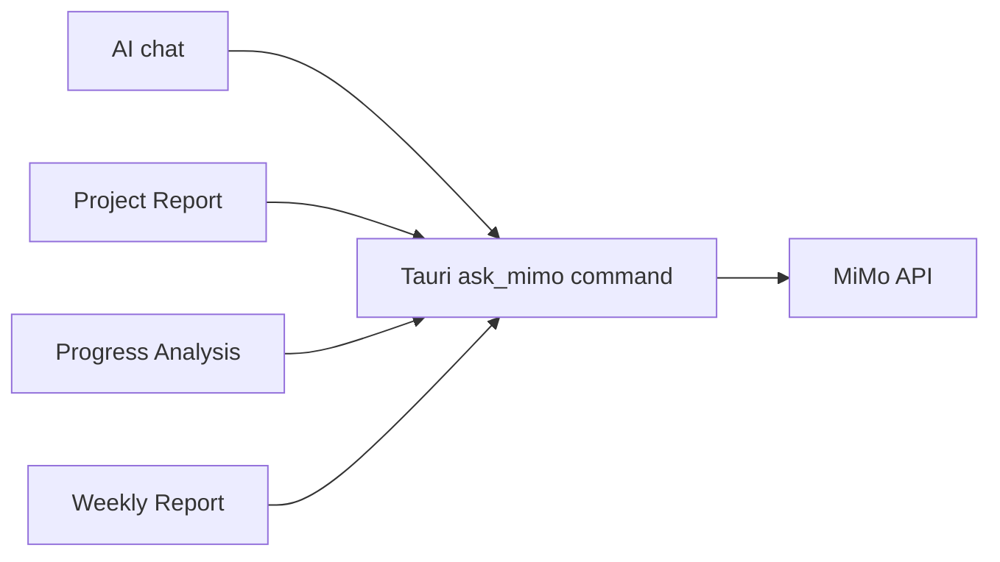
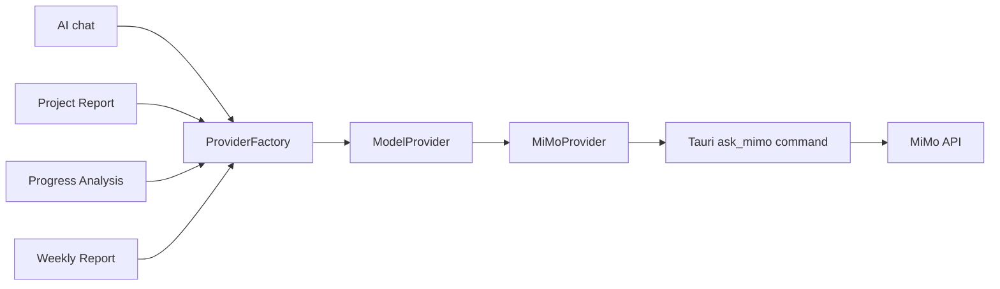

# Model Provider V8

## Purpose

The model provider layer gives every product AI feature one minimal interface:

```ts
send(prompt: string): Promise<string>
```

This is an internal architecture boundary only. It does not change prompts,
request payloads, response parsing, output formatting, or UI behavior.

## Before



Each feature invoked `ask_mimo` directly from `App.tsx`.

## After



`ProviderFactory` always returns `MiMoProvider`. There is no provider setting,
runtime switch, or UI exposure.

## MiMo Integration

`MiMoProvider` preserves the existing Tauri call exactly:

- command: `ask_mimo`
- arguments: `prompt` and `apiKey`
- result: the original string returned by the command
- errors: propagated unchanged to existing feature-level error handling

The Rust command remains responsible for the existing MiMo request format,
credential fallback, HTTP request, and response parsing. Keeping that transport
in Rust preserves the current security and runtime behavior.

## Future Extension Points

Future providers could implement the same `ModelProvider` interface, for
example:

- `OpenAIProvider` (placeholder only)
- `OpenRouterProvider` (placeholder only)

Adding either provider would also require an explicit selection policy in the
factory. No such provider or selection behavior is implemented in V8.
