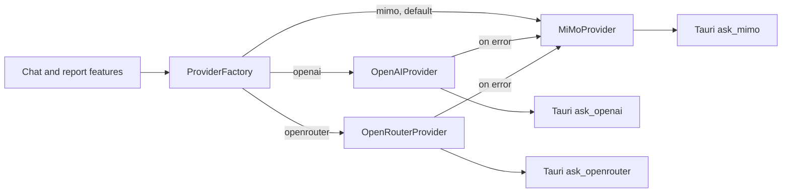

# V8.1 Multi-Provider Architecture

## Overview

V8.1 extends the V8 `ModelProvider` boundary with OpenAI and OpenRouter while
keeping MiMo as the default provider. Product features continue to depend only
on:

```ts
send(prompt: string): Promise<string>
```

Prompts, report formats, chat behavior, and UI are unchanged.



## Provider Selection

`ProviderConfig.ts` is the single provider configuration source. Set the
non-secret build-time variable in `apps/desktop/.env.local`:

```dotenv
VITE_MODEL_PROVIDER=mimo
```

Supported values are `mimo`, `openai`, and `openrouter`. Missing, empty, or
unknown values resolve to `mimo`. Restart the development process or rebuild
the app after changing this value.

## Environment Variables

Provider credentials stay in the Rust process and are never included in the
frontend bundle. Put optional provider keys in `apps/desktop/src-tauri/.env.local`
or the process environment:

```dotenv
OPENAI_API_KEY=your-key
OPENROUTER_API_KEY=your-key
```

MiMo continues to use its existing `MIMO_API_KEY`, keychain fallback,
`MIMO_API_URL`, and `MIMO_MODEL` behavior.

Default models are defined in `ProviderConfig.ts`:

- MiMo: `mimo-v2.5` (the Rust command keeps the existing `MIMO_MODEL` override)
- OpenAI: `gpt-4o-mini`
- OpenRouter: `openai/gpt-4o-mini`

## Requests and Responses

OpenAI uses `https://api.openai.com/v1/chat/completions`. OpenRouter uses
`https://openrouter.ai/api/v1/chat/completions`. Both send one user message
containing the unchanged product prompt and return only
`choices[0].message.content`.

References:

- [OpenAI Chat Completions API](https://platform.openai.com/docs/api-reference/chat/create-chat-completion)
- [OpenRouter Chat Completions API](https://openrouter.ai/docs/api/api-reference/chat/send-chat-completion-request)

## Automatic Fallback

When OpenAI or OpenRouter is selected, `ProviderFactory` wraps it with the
existing `MiMoProvider`. Any primary-provider error, including a missing key,
network failure, non-success HTTP status, malformed response, or empty assistant
content, retries the exact same prompt with MiMo. MiMo itself is not wrapped, so
its default behavior remains unchanged.

## Adding a Provider

1. Implement `ModelProvider.send(prompt)` in a new provider class.
2. Keep credentials in Rust and expose a narrow Tauri command.
3. Add the provider name, key environment variable name, and default model to
   `ProviderConfig.ts`.
4. Add the provider branch and MiMo fallback in `ProviderFactory.ts`.
5. Add response parsing and fallback tests without changing feature prompts.
